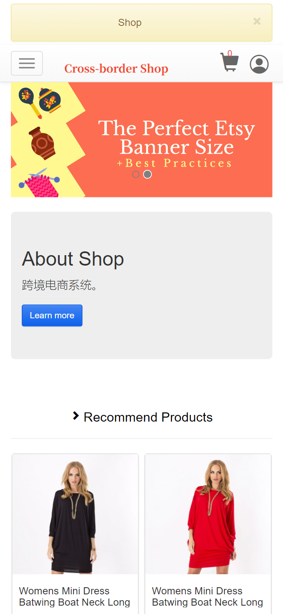
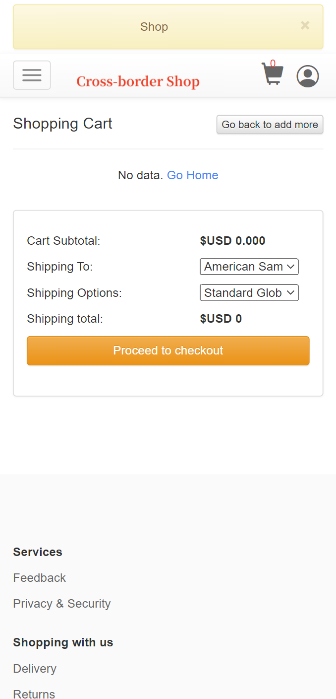
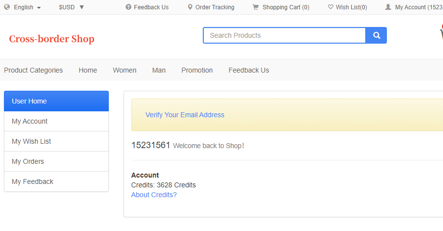
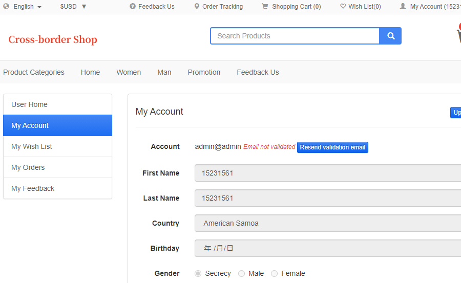
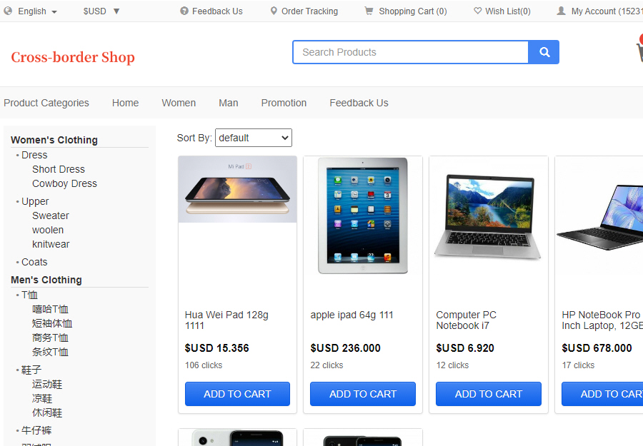
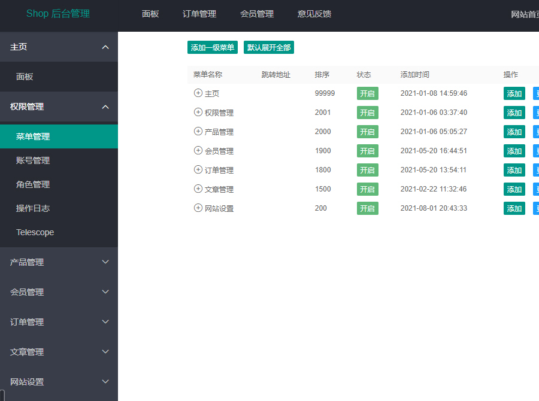
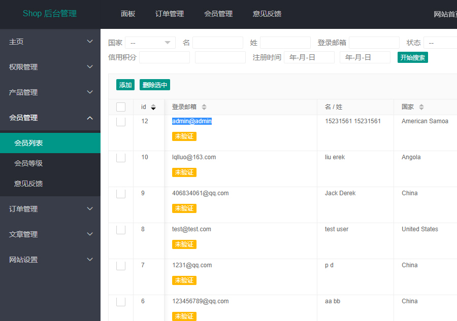

# 基于Laravel框架的跨境电商商城，支持多语言，多货币，多种国际配送方式PC和移动端

演示地址：https://ssshop.waps.eu.org

说明：

1：基于Laravel框架的跨境电商商城。

2：多货币。

3：支持多语言。

4：多种国际配送方式。

5：PC 端和移动端自适应。

（Ver 2.05）

1: 此钱包基于稳定的Laravel框架内核。

2: 优化并修复众多bug。

3: 移除多余的js代码。

4: 优化后端速度。

## Screenshots

# 声明

1. 使用本系统方必须在国家相关法律法规范围内并经过国家相关部门的授权许可，禁止用于一切非法行为。

2. 本系统限于测试、实验、研究为目的，禁止用于一切商业运营，本团队不承担使用者在使用过程中的任何违法行为负责。

3. 源码以演示站为准。

