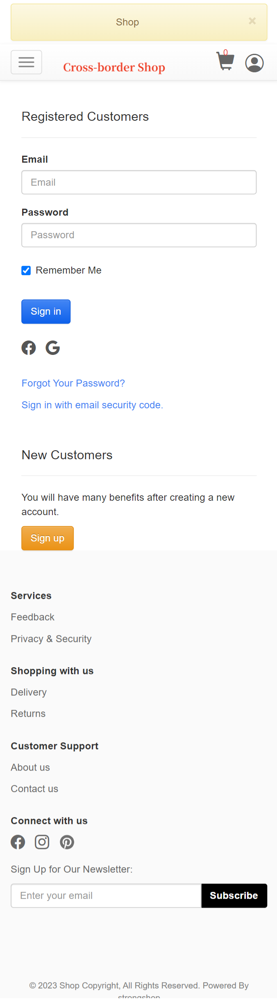

# 基于Laravel框架的跨境电商商城，支持多语言，多货币，多种国际配送方式PC和移动端

演示地址：https://ssshop.waps.eu.org

说明：

1：基于Laravel框架的跨境电商商城。

2：多货币。

3：支持多语言。

4：多种国际配送方式。

5：PC 端和移动端自适应。

（Ver 2.05）

1: 此钱包基于稳定的Laravel框架内核。

2: 优化并修复众多bug。

3: 移除多余的js代码。

4: 优化后端速度。

## Screenshots

